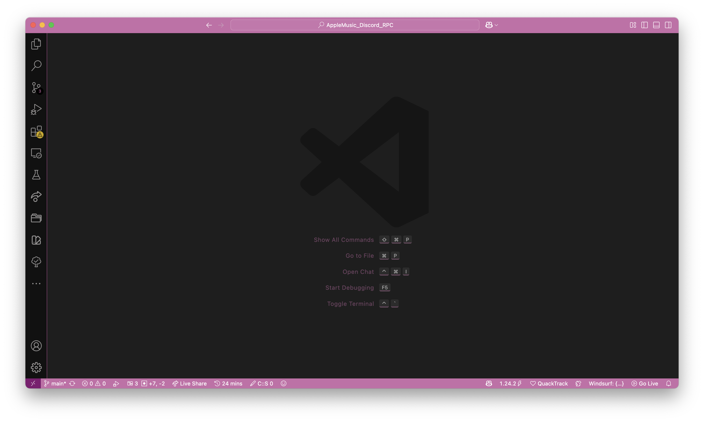

# 🖥️ code




My Visual Studio Code configuration on different platforms (Windows and macOS, in this case)

⚠️ Notice: Be prepared that you need a better computer if you decide to install all extensions from extensions.txt.

## 💾 Installation

Open terminal in directory with repository.

### 🐧🍎 Linux/macOS

Just type in terminal:

```sh
$ ./install.sh
```

⚠️ Notice: Untested on Linux, because I don't have it anymore. Although, it's should work anywhere you can run VS Code. ¯\_(ツ)_/¯

### 🪟 Windows

First, in administrator mode in PowerShell type:

```powershell
PS C:\> Set-ExecutionPolicy Bypass
```

Next, run PowerShell again, and type:

```powershell
PS C:\> .\install.ps1
```

For `settings.json` installation, just open settings file from Command Palette in VS Code and copy-paste my file.

## ❓ FAQ

**Q:** Why are you need a lot of extensions?

**A:** In fact, I don't really need 4894254982024 extensions for example. Despites number of installed extensions currently almost reached 100 extensions (93 extensions while I'm writing this FAQ). But in this beautiful number of 100, every useful extensions:

- programming languages support
- theme
- some fun plugins like duck cursor
- rainbow indents
- AI completion
- color pickers
- workspaces
- test runners
- WakaTime
- CodeStats
- etc.

to me are presented. I will create a install script in which you can decide what you need to.
