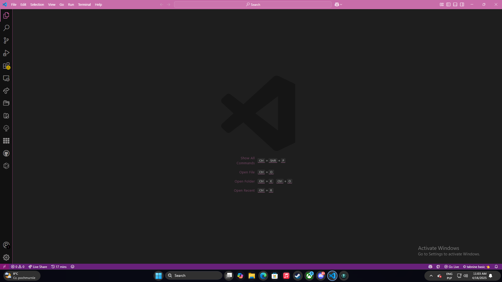

# 🖥️ code



My Visual Studio Code configuration

## 💾 Installation

Open terminal in directory with repository.

### 🐧🍎 Linux/macOS

Just type in terminal:

```sh
$ ./install.sh
```

### 🪟 Windows

First, in administrator mode in PowerShell type:

```powershell
PS C:\> Set-ExecutionPolicy Bypass
```

Next, run PowerShell again, and type:

```powershell
PS C:\> .\install.ps1
```

For `settings.json` installation, just open settings file from Command Palette in VS Code and copy-paste my file. 
